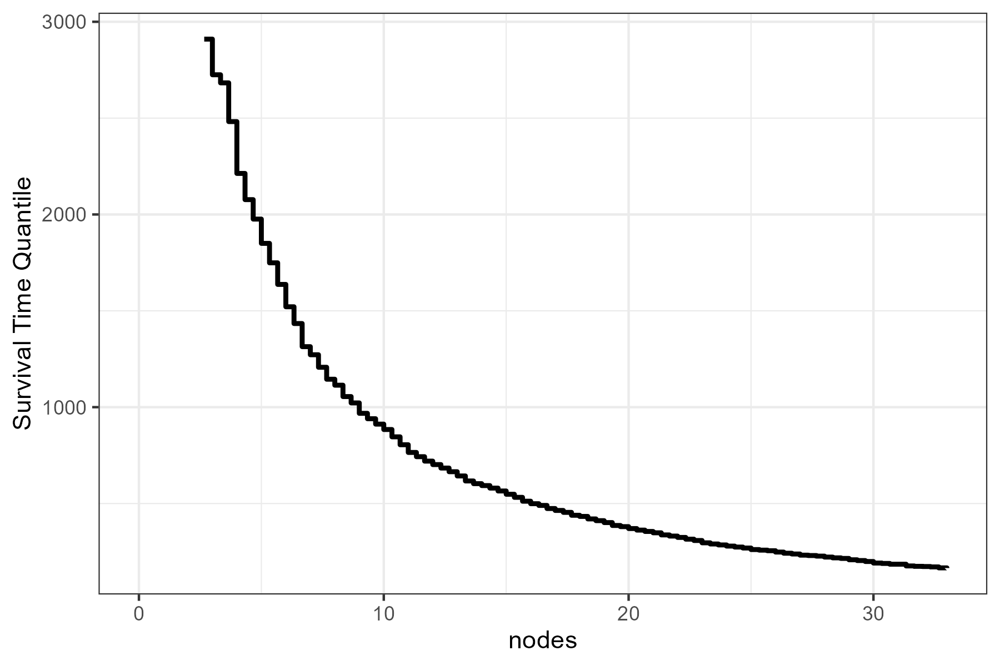

<!-- badges: start -->
[](https://www.repostatus.org/#active)
[](https://cran.r-project.org/package=contsurvplot)
[](https://cran.r-project.org/package=contsurvplot)
[](https://github.com/RobinDenz1/contsurvplot/actions)
[](https://app.codecov.io/gh/RobinDenz1/contsurvplot?branch=main)
<!-- badges: end -->

# contsurvplot 

Author: Robin Denz

## Description

`contsurvplot` is an R-Package which can be used to visualize the causal effect of a continuous variable on a time-to-event outcome.
It includes multiple different plot types, such as survival area plots, contour plots, heatmaps, survival quantile plots and more.
All of them can be adjusted for confounders and all of them have a lot of build in options to customize them according to the users needs.
Also, most of the plot functions are based on the `ggplot2` package, allowing the user to use the standard `ggplot2` syntax to customize the plots further.

## Installation

The stable release version can be installed directly from CRAN using:

```R
install.packages("contsurvplot")
```

Alternatively, the development version can be installed using the `devtools` R-Package:

```R
library(devtools)

devtools::install_github("RobinDenz1/contsurvplot")
```

or the `remotes` R-Package:

```R
library(remotes)

remotes::install_github("RobinDenz1/contsurvplot")
```

## Bug Reports and Feature Requests

If you encounter any bugs or have any specific feature requests, please file an [Issue](https://github.com/RobinDenz1/contsurvplot/issues).

## Examples

Here are two quick examples using the `colon` dataset from the `survival` R-Package.
Suppose we want to visualize the effect of the number of lymph nodes with detectable cancer (column `nodes`) on the survival time.
A survival area plot can be produced using the following code:

```R
library(contsurvplot)
library(ggplot2)
library(survival)
library(riskRegression)

# load colon data
data(cancer)

# fit cox model, adjusting for age and sex
model <- coxph(Surv(time, status) ~ age + sex + nodes, data=colon, x=TRUE)

# plot survival area
plot_surv_area(time="time",
		status="status",
		variable="nodes",
		data=colon,
		model=model)

```


Alternatively, we can plot a contour plot to visualize the effect:

```R
plot_surv_contour(time="time",
		  status="status",
		  variable="nodes",
		  data=colon,
		  model=model)
```


Or we can use a simple plot of the median survival time as a function of `nodes`:

```R
plot_surv_quantiles(time="time",
		   status="status",
		   variable="nodes",
		   data=colon,
		   model=model,
		   p=0.5)
```


More examples can be found in the documentation and the vignette.

## Citation

The main paper associated with this R-Package is:

Robin Denz, Nina Timmesfeld (2023). *Visualizing the (causal) effect of a continuous variable on a time-to-event outcome*. Epidemiology. 34.5 <doi:10.1097/EDE.0000000000001630>

In addition, some relevant literature can be found in the documentation pages.

## License

© 2022 Robin Denz

The contents of this repository are distributed under the GNU General Public License. You can find the full text of this License in this github repository. Alternatively, see <http://www.gnu.org/licenses/>.
