# Visualizing the Causal Effect of a Continuous Variable on a Time-To-Event Outcome

## Introduction

Stratified survival curves are a great way to visualize the effect of a
categorical variable, such as treatment status, on the survival time.
They are easy to produce, easy to understand and (if done correctly)
visually appealing. The situation is slightly more complicated when
confounders exist that need to be accounted for. In this case, methods
that explicitly remove the influence of confounders need to be used to
estimate the curves. Luckily, there are quite a few of those methods and
also associated R-packages that implement them directly, such as the
`adjustedCurves` package (Denz et al. 2023).

In many cases however, we are not interested in the effect of a
categorical variable. Instead we want to show the effect of a
*continuous* variable, for example when studying a new biomarker to
predict a certain disease. Currently, there is only a small amount of
research on this topic and even less publicly available code. When
confounder-adjustment is required, the available code and literature is
practically non-existent.

The `contsurvplot` package tries to fill this gap by providing multiple
types of plots to visualize the causal effect of a continuous variable
on a time-to-event outcome (Denz & Timmesfeld 2023). All plots included
rely on a previously fit model that describes the effect of the target
variable on the time-to-event outcome. This model is then used to
perform *G-Computation* (Robins 1986) to estimate
covariate-level-specific survival curves or cumulative incidence
functions (CIF). By including confounders in the model, all plots are
naturally adjusted for these confounders. In this vignette, we will
showcase the usage of these methods. More details and discussion of the
plots presented here can be found in the paper associated with this
package (Denz & Timmesfeld 2023).

## Installation

The stable release version of this package can be installed directly
from CRAN using:

``` r
install.packages("contsurvplot")
```

Alternatively, the developmental version can be installed from github,
using the following code:

``` r
devtools::install_github("RobinDenz1/contsurvplot")
```

## Example Data and Setup

First we will load all required packages. This seems like a lot, but
most of them are only required for one plot each.

``` r
library(contsurvplot)
library(ggplot2)
library(dplyr)
library(rlang)
library(riskRegression)
library(survival)
library(pammtools)
library(gganimate)
library(transformr)
library(plotly)
library(reshape2)
library(knitr)
library(rmarkdown)
```

As an example we will utilize the `colon` dataset included in the famous
`survival` R-package. It includes data on 1858 patients from a study
about treating colon cancer using adjuvant chemotherapy. We can obtain
the `colon` data by using the
[`data()`](https://rdrr.io/r/utils/data.html) function. Below are the
first few rows of the dataset:

``` r
data(cancer)
colon$sex <- factor(colon$sex)

head(colon)
#>   id study      rx sex age obstruct perfor adhere nodes status differ extent
#> 1  1     1 Lev+5FU   1  43        0      0      0     5      1      2      3
#> 2  1     1 Lev+5FU   1  43        0      0      0     5      1      2      3
#> 3  2     1 Lev+5FU   1  63        0      0      0     1      0      2      3
#> 4  2     1 Lev+5FU   1  63        0      0      0     1      0      2      3
#> 5  3     1     Obs   0  71        0      0      1     7      1      2      2
#> 6  3     1     Obs   0  71        0      0      1     7      1      2      2
#>   surg node4 time etype
#> 1    0     1 1521     2
#> 2    0     1  968     1
#> 3    0     0 3087     2
#> 4    0     0 3087     1
#> 5    0     1  963     2
#> 6    0     1  542     1
```

For exemplary purposes, suppose that we are only interested in the
causal effect of the number of lymph nodes with detectable cancer
(column `nodes`). This is a semi-continuous variable only, because it is
only defined for integers. We will however treat it as a proper
continuous variable here, since it makes no difference for the examples.

First, we need a model describing the time-to-event outcome in order to
make any plots possible. Here, we will simply use a cox-regression
model, including the covariates `age`, `sex` and `nodes` as independent
variables:

``` r
model <- coxph(Surv(time, status) ~ age + sex + nodes, data=colon, x=TRUE)
```

It is important that we use `x=TRUE` in the function call, otherwise it
won’t be possible to create the needed estimates. By including `age` and
`sex`, we are adjusting all graphics below for these variables.

By using the standard `summary` method of the `coxph` model object, we
can take a look at the estimated hazard-ratios:

``` r
summary(model)
#> Call:
#> coxph(formula = Surv(time, status) ~ age + sex + nodes, data = colon, 
#>     x = TRUE)
#> 
#>   n= 1822, number of events= 897 
#>    (36 observations deleted due to missingness)
#> 
#>             coef  exp(coef)   se(coef)      z Pr(>|z|)    
#> age    0.0004934  1.0004936  0.0028216  0.175    0.861    
#> sex1  -0.0645554  0.9374842  0.0669405 -0.964    0.335    
#> nodes  0.0872323  1.0911501  0.0063330 13.774   <2e-16 ***
#> ---
#> Signif. codes:  0 '***' 0.001 '**' 0.01 '*' 0.05 '.' 0.1 ' ' 1
#> 
#>       exp(coef) exp(-coef) lower .95 upper .95
#> age      1.0005     0.9995    0.9950     1.006
#> sex1     0.9375     1.0667    0.8222     1.069
#> nodes    1.0912     0.9165    1.0777     1.105
#> 
#> Concordance= 0.628  (se = 0.009 )
#> Likelihood ratio test= 134.1  on 3 df,   p=<2e-16
#> Wald test            = 191.9  on 3 df,   p=<2e-16
#> Score (logrank) test = 195.4  on 3 df,   p=<2e-16
```

We can see that the hazard-ratio of the target variable `nodes` is
approximately 1.091. Together with a very small p-value, this indicates
that the survival probability of the patients decreases with a rising
number of affected lymph nodes. This is a plausible (and hardly
shocking) result.

But how bad is a hazard-ratio of 1.091 exactly? A trained statistician
might have no problem interpreting this number correctly, but for many
other medical scientists this number might not mean that much.
Appropriate visualizations are the key to proper communication of such
regression results. Because relative effect measures, such as the
hazard-ratio, are inherently harder to interpret than absolute effect
measures, we will only use the latter. This includes the standard
survival probability at time $t$.

## How do We get the Survival Probability from the Model?

Internally, all plot functions call the `curve_cont` function to perform
g-computation in order to obtain survival probability estimates at $t$
that would have been observed if all patients had a specific value of
the continuous covariate. Internally, it uses the `predictRisk` function
from the `riskRegression` package to do this (Ozenne et al. 2017). For
example, lets look at this specific function call:

``` r
curve_cont(data=colon, variable="nodes", model=model,
           horizon=c(0, 10, 15), times=c(1000, 2000))
#>   time       est cont
#> 1 1000 0.7244607    0
#> 2 2000 0.6290340    0
#> 3 1000 0.4625632   10
#> 4 2000 0.3299905   10
#> 5 1000 0.3035407   15
#> 6 2000 0.1800854   15
```

Using the previously fit cox-regression model, this function outputs a
single row for each covariate - time combination with an associated
survival time. The first column shows the average survival probability
of all patients at $t = 1000$, if they all had $0$ lymph nodes with
detectable cancer. In this case, the probability is approximately 0.724.
Similarly, if all patients would have had 10 affected lymph nodes, the
average survival probability would be much lower at approximately 0.462.

By estimating these probabilities for a wide range of times and values
of the continuous variable, we effectively get a three dimensional
counterfactual survival curve. If the model is correctly specified, the
estimates will be unbiased with an easy causal interpretation. All
that’s left is to visualize them appropriately.

## Plots Based on Summary Statistics

There are some plots based on summary statistics of survival curves as
they evolve with the continuous variable. The main idea here is to
reduce the visualization to two dimensions by summarizing the survival
curves at specific values of the variable in one value. This statistic
can then be plotted as a single line.

### Survival Probability at t

The simplest of all is to plot the survival probability at a specific
point in time as a function of the continuous variable. This can be done
in the `contsurvplot` package using the `plot_surv_at_t` function. For
example, the following graph can be produced using $t = 1000$

``` r
plot_surv_at_t(time="time",
               status="status",
               variable="nodes",
               data=colon,
               model=model,
               t=1000)
```

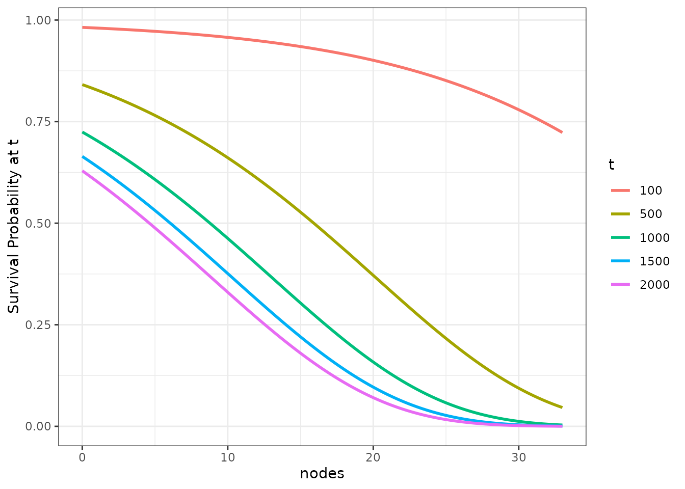

We can make this graph a little more interesting by plotting the
survival probability at multiple points in time at once:

``` r
plot_surv_at_t(time="time",
               status="status",
               variable="nodes",
               data=colon,
               model=model,
               t=c(100, 500, 1000, 1500, 2000))
```


Although this function is easy to produce and to understand, it lacks
information about the survival probability at all other times not shown.
It is best to use this method only when there are specific (possibly
pre-specified) times of interest.

### Survival Time Quantiles

The same kind of graphic can be produced for survival time quantiles
using the `plot_surv_quantiles` function. The following plot shows the
effect of the `nodes` on the most popular survival time quantile - the
median survival time:

``` r
plot_surv_quantiles(time="time",
                    status="status",
                    variable="nodes",
                    data=colon,
                    model=model,
                    p=0.5)
```

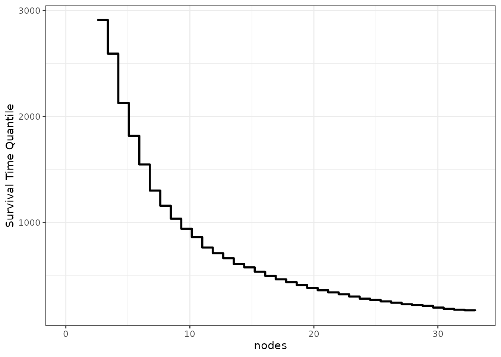

We can also use this function to plot multiple survival time quantiles
at once:

``` r
plot_surv_quantiles(time="time",
                    status="status",
                    variable="nodes",
                    data=colon,
                    model=model,
                    p=c(0.1, 0.25, 0.5, 0.75, 0.9))
```


While a little more sophisticated, this type of plot shares the same
problem of the plot before it. It is still only one point of the
respective survival curves visualized over the range of the target
variable.

### Restricted Mean Survival Time

A different kind of statistic is the restricted mean survival time
(RMST). It is defined as the area under the survival curve up to a
specific point $\tau$ and can be interpreted as the mean survival time
of the cohort in the interval $\lbrack 0,\tau\rbrack$. By taking the
whole integral, this statistic technically takes the whole survival
curve in the specific interval into account. However, it is still
dependent on $\tau$.

A graph similar to the ones above, but using the RSMT, can be produced
using the `plot_surv_rmst` function:

``` r
plot_surv_rmst(time="time",
               status="status",
               variable="nodes",
               data=colon,
               model=model,
               tau=1000)
```

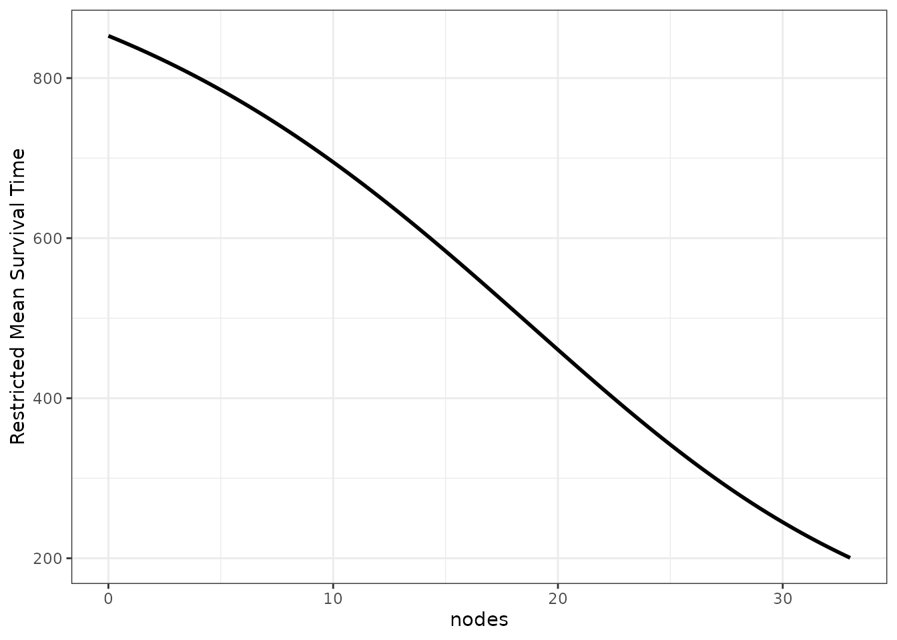

To show how the estimates change with different values of $\tau$, we can
also supply multiple values yet again to produce multiple curves:

``` r
plot_surv_rmst(time="time",
               status="status",
               variable="nodes",
               data=colon,
               model=model,
               tau=c(500, 1000, 2000))
```

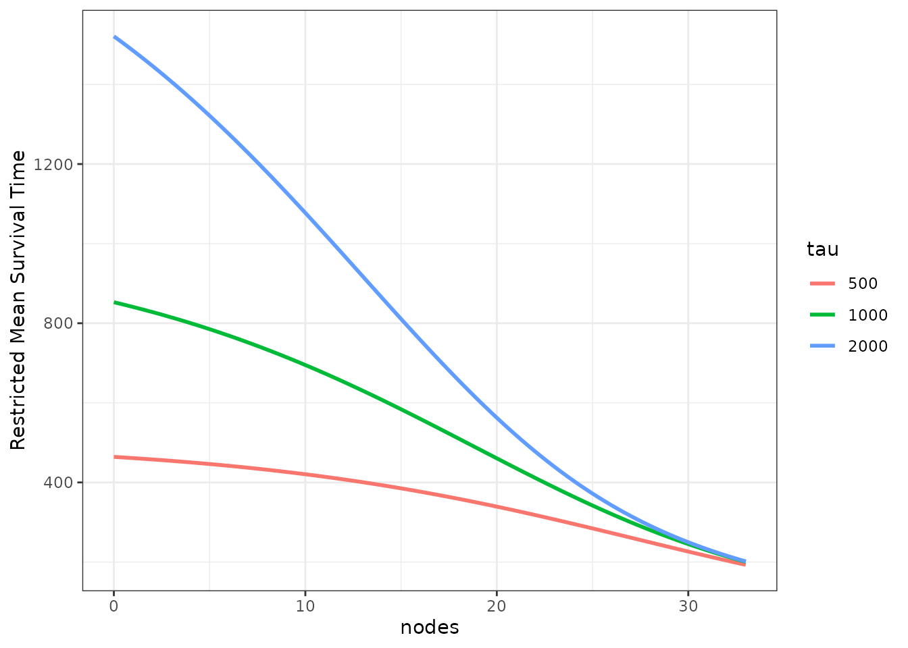

### Restricted Mean Time Lost

The restricted mean time lost (RMTL) is very closely related to the
RMST. Instead of integrating the area under the survival curve, the area
under the cumulative incidence function (CIF) is calculated. This can be
useful when there are multiple mutually exclusive event types, in which
case only the cause-specific CIF can be estimated, but not the
cause-specific survival curve.

The `plot_surv_rmtl` function can be used for this purpose. It has the
same functionality and syntax as the `plot_surv_rmst` function, so we
will only show one plot with multiple $\tau$ values below:

``` r
plot_surv_rmtl(time="time",
               status="status",
               variable="nodes",
               data=colon,
               model=model,
               tau=c(500, 1000, 2000))
```


Since this is a simple survival case with only one event type, the
equation $F(t) = 1 - S(t)$ still holds, which is why the curves are
simply inverted.

## Plots Showing the Entire Survival Area

In many cases it makes more sense to plot the entire 3D survival curve
dependent on the continuous variable. There are a few options to do
this. Each of them has different pros and cons, none is a solve-it-all
magic bullet. The choice of plot is highly dependent on the data at
hand.

### Single Curves

The simplest way to plot the entire survival curve is picking a few
specific values of the variable (in our case a few specific numbers of
affected lymph nodes) and plotting the causal survival curve for each
one. This can be done using the `plot_surv_lines` function. Here, we
pick a few equally spaced values:

``` r
plot_surv_lines(time="time",
                status="status",
                variable="nodes",
                data=colon,
                model=model,
                horizon=c(0, 5, 10, 15, 20, 25, 30))
```

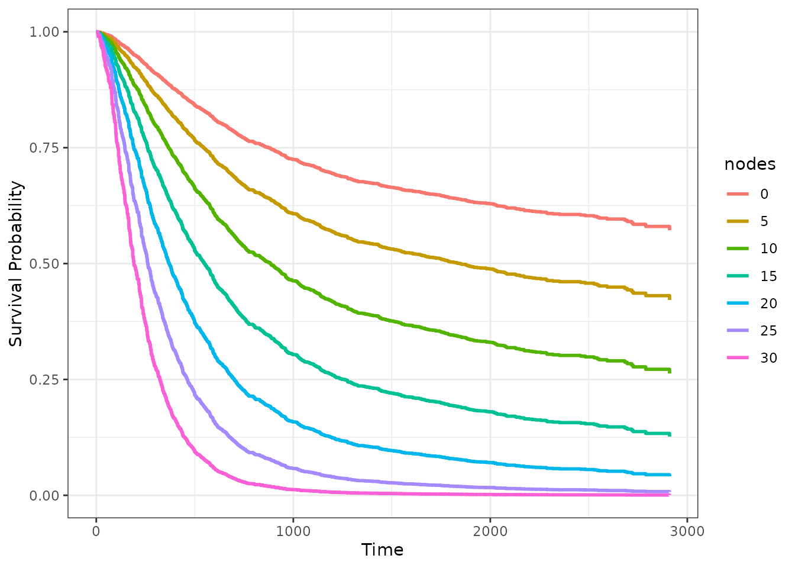

### Survival Area

The single survival curves do however tend to obscure the fact that
there is a continuous transition between the covariate values. One way
to make this a little more explicit is to use the `plot_surv_area`
function, which is similar, but plots the area between those single
curves as well.

Using the default values, it gives us a continuously colored area for
the whole range of possible lymph node values:

``` r
plot_surv_area(time="time",
               status="status",
               variable="nodes",
               data=colon,
               model=model)
```

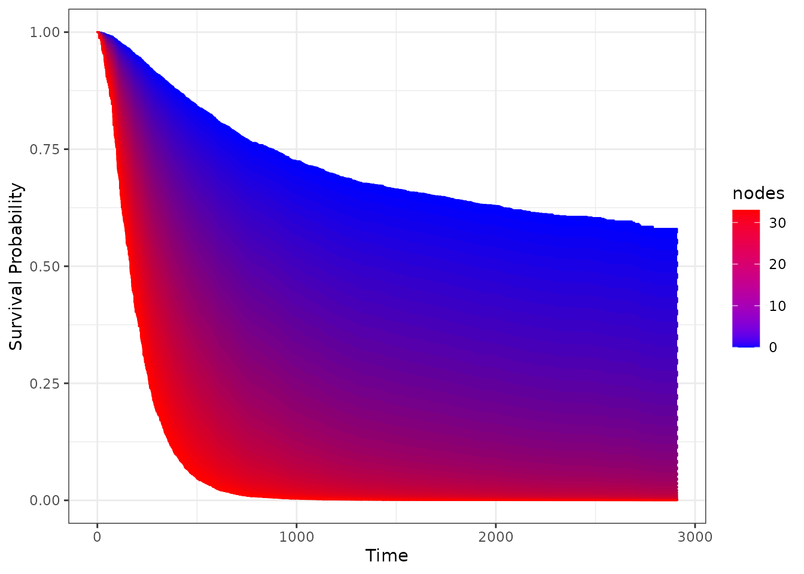

It achieves this by calculating a big amount of variable (`nodes`)
specific survival curves and filling the area between them continuously.

We can take a step back and divide the area in discrete bins, coloring
them similarly:

``` r
plot_surv_area(time="time",
               status="status",
               variable="nodes",
               data=colon,
               model=model,
               discrete=TRUE)
```

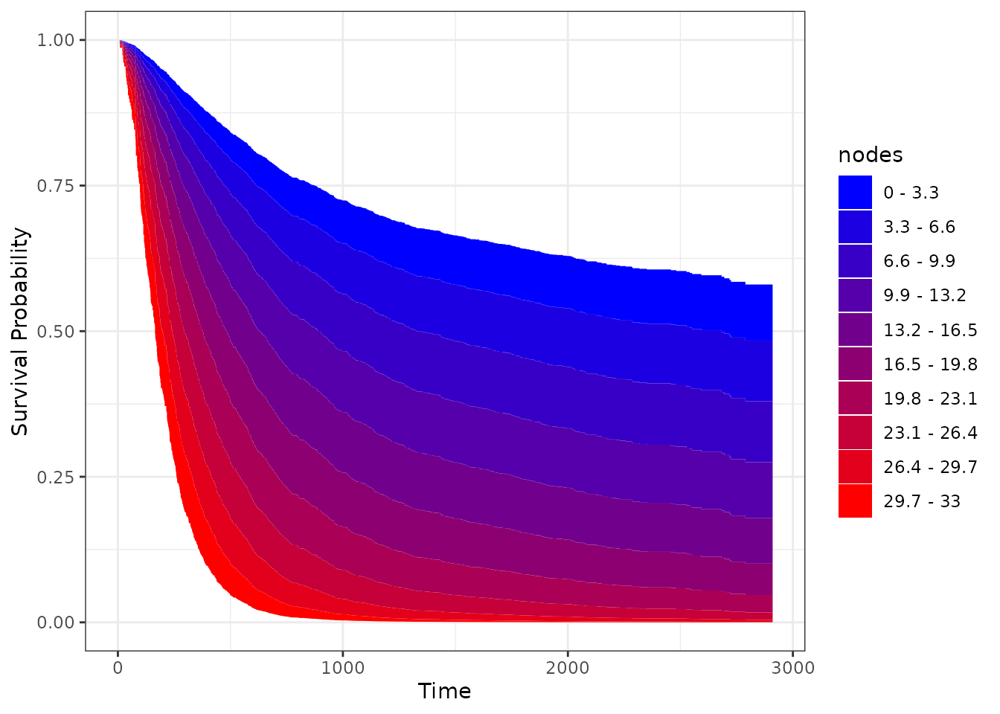

Of course we can change the colors as well. Either by providing
`start_color` and `end_color` values for a graded scale as used above,
or by supplying a vector of specific colors using the `custom_color`
argument. We will show only the first option here, using a black and
white scale with a little fewer bins:

``` r
plot_surv_area(time="time",
               status="status",
               variable="nodes",
               data=colon,
               model=model,
               discrete=TRUE,
               bins=5,
               start_color="lightgrey",
               end_color="black")
```

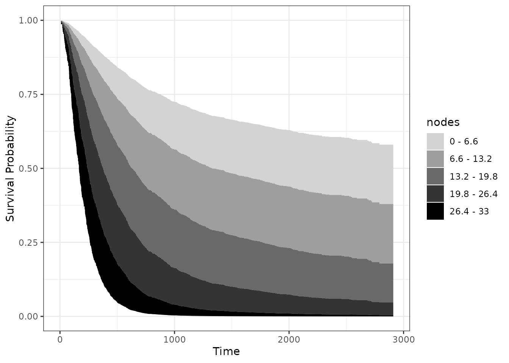

By keeping the x-axis and y-axis as well as the shape of a normal
survival curve, we think that this type of plot is very appropriate in
many situations. It does, however, only work if the effect of the
continuous covariate is linear or at least always monotonically
increasing or decreasing. For example, using the Body-Mass-Index would
not work with this type of plot, as the BMI usually has a curved
relationship on survival.

### Survival Heatmap

One way around this is to use a heatmap instead, which can be created
using the `plot_surv_heatmap` function:

``` r
plot_surv_heatmap(time="time",
                  status="status",
                  variable="nodes",
                  data=colon,
                  model=model,
                  start_color="blue",
                  end_color="red")
```

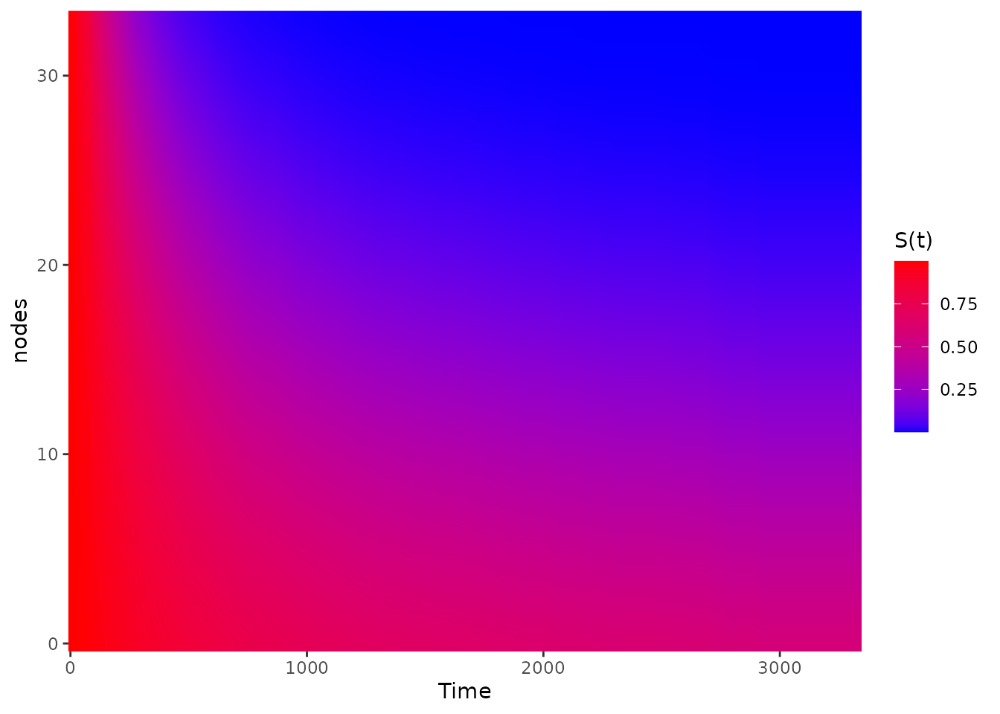

In this plot the survival time is still on the x-axis, but the
continuous variable (here the lymph nodes) is on the y-axis and the
survival probability at each point is shown using a continuous color
scale. This works well if the variable has a big effect on the survival,
as is the case here. It does however tend to obscure small causal
effects.

As a visual help, we can add some equally spaced contour lines to it
using the `contour_lines` argument:

``` r
plot_surv_heatmap(time="time",
                  status="status",
                  variable="nodes",
                  data=colon,
                  model=model,
                  contour_lines=TRUE,
                  start_color="blue",
                  end_color="red")
```

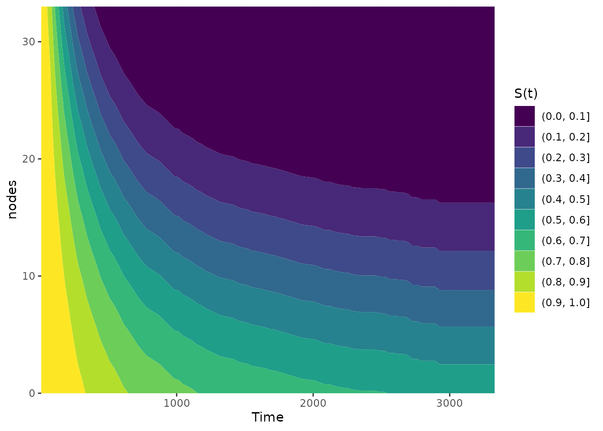

### Survival Contours

We can of course go a step further than the `plot_surv_heatmap` and plot
an entire contour plot using the `plot_surv_contour` function:

``` r
plot_surv_contour(time="time",
                  status="status",
                  variable="nodes",
                  data=colon,
                  model=model)
```


We can also change the number of `bins` here:

``` r
plot_surv_contour(time="time",
                  status="status",
                  variable="nodes",
                  data=colon,
                  model=model,
                  bins=5)
```

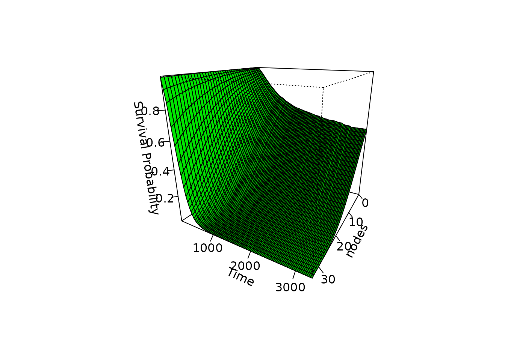

This type of plot is preferable to the heatmap in most cases. In case of
a very smooth effect, the simple heatmap might be a better choice
though.

### Survival Matrix

A different version of a heatmap can be created using the
`plot_surv_matrix` function. Instead of using a smooth area with color
scaling, this type of plot divides the are into rectangles and displays
the average survival probability inside those. It can be created like
this:

``` r
plot_surv_matrix(time="time",
                 status="status",
                 variable="nodes",
                 data=colon,
                 model=model)
```

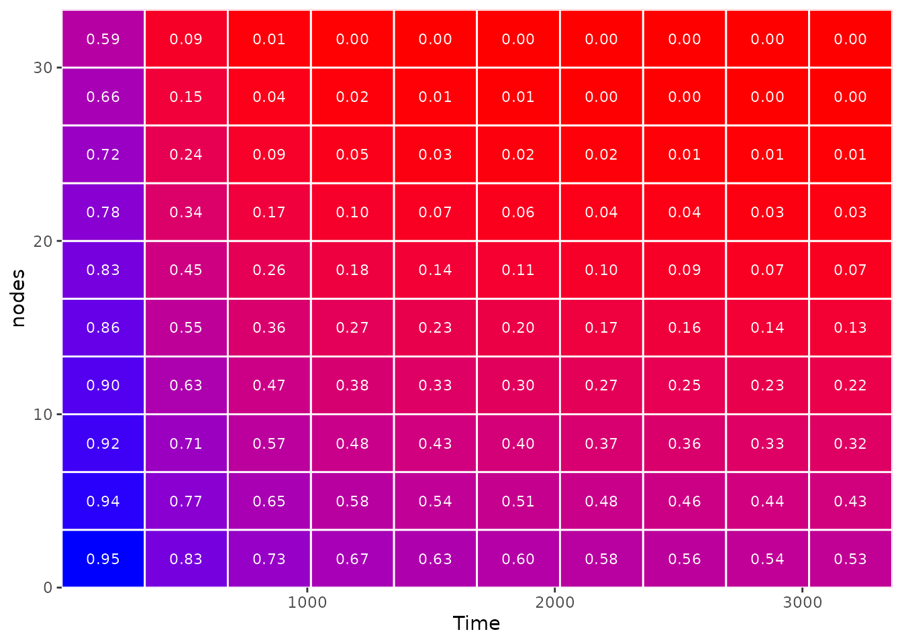

This type of heatmap is definitely easier to interpret (and arguably
more pretty), but it also swallows up information by only displaying
*average* survival probabilities in each rectangle. It is important to
check whether the underlying smooth effect is correctly displayed with
the current amount of rectangles and to change the dimensions of the
matrix accordingly.

In this case, using a 10 x 10 matrix seems fine. This is what it would
look like to use only a 5 x 5 matrix:

``` r
plot_surv_matrix(time="time",
                 status="status",
                 variable="nodes",
                 data=colon,
                 model=model,
                 n_col=5,
                 n_row=5)
```

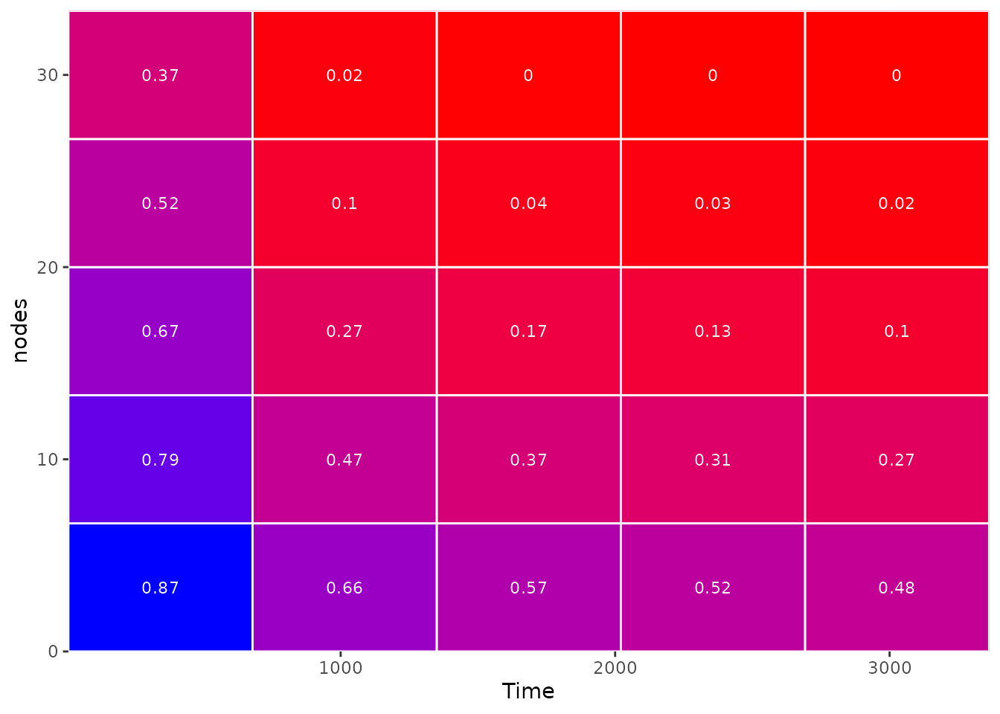

25 rectangles are clearly not enough in this case.

### Survival 3D Surface

Although frowned upon by many scientists, it almost feels natural to use
a 3D surface plot here. All plots above are attempts at showing a
three-dimensional surface in a two-dimensional plot using color scales.
Why not actually show the three-dimensional surface directly? We can do
this using the `plot_surv_3Dsurface` function:

``` r
plot_surv_3Dsurface(time="time",
                    status="status",
                    variable="nodes",
                    data=colon,
                    model=model)
```


In this particular case, the plot is not too bad. But the usual
criticism of 3D plots still holds here. Identifying single points in
this 3D plane is almost impossible. Without being able to rotate this
figure interactively, this seems like a sub-optimal visualization choice
compared to the other plots above.

## Plots for Digital Use Only

If we are not forced to put the plot on paper, however, there is no
reason not to use the interactive nature of computers. There are two
implemented methods for interactive survival plots in this package, both
based on the `plotly` package. Another plot method based on a simple
animation is also implemented.

### Interactive 3D Surface Plots

By setting the `interactive` argument to `TRUE` in the
`plot_surv_3Dsurface` plot, we can overcome some difficulties of the 3D
plot shown above:

``` r
# NOT RUN, to keep the vignette size reasonable
plot_surv_3Dsurface(time="time",
                    status="status",
                    variable="nodes",
                    data=colon,
                    model=model,
                    interactive=TRUE)
```

### Using a Slider

A different way to create an interactive plot is using a slider. On the
first look, this plot looks like a standard survival curve. Until you
notice the slider. It can be used to specify different values of the
continuous variable dynamically. This type of plot can be created using
the `plot_surv_animated` function, setting the `slider` argument to
`TRUE`. For visual clarity, we also set the `horizon` argument to some
reasonable values here:

``` r
# NOT RUN, to keep the vignette size reasonable
plot_surv_animated(time="time",
                   status="status",
                   variable="nodes",
                   data=colon,
                   model=model,
                   slider=TRUE,
                   horizon=seq(0, 30, 1))
```

### Using Animation

If we don’t want the user to have to do anything, we can also create the
same plot, but making it animated by default. It will cycle through the
covariate values in `horizon` one at a time at an equal speed forever,
showing what happens to the survival curve.

This type of plot can be created using the `plot_surv_animated` function
again, but setting `slider=FALSE` this time:

``` r
# NOT RUN, to keep the vignette size reasonable
plot_surv_animated(time="time",
                   status="status",
                   variable="nodes",
                   data=colon,
                   model=model,
                   slider=FALSE,
                   horizon=seq(0, 30, 1))
```

## Facetting by Groups

In some scenarios it might be useful to display the average treatment
effect separately for some subgroups. Most plot functions in this
package support this directly using the `group` argument. The grouping
variable should be a factor variable that is included as independent
variable in the used `model`. For example, we used `sex` as an
independent factor variable here. To obtain **survival contour plots**
conditional on the sex of the patients, we can use the following code:

``` r
plot_surv_contour(time="time",
                  status="status",
                  variable="nodes",
                  group="sex",
                  data=colon,
                  model=model)
```

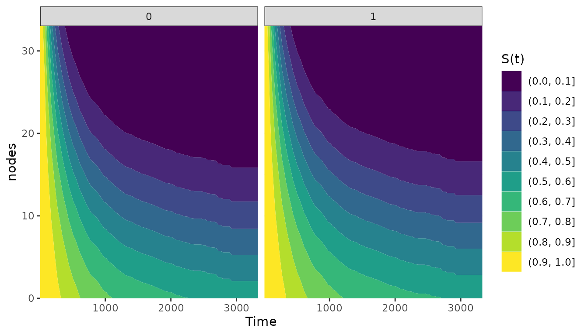

This also works for **survival area plots** in exactly the same way:

``` r
plot_surv_area(time="time",
               status="status",
               variable="nodes",
               group="sex",
               data=colon,
               model=model)
```

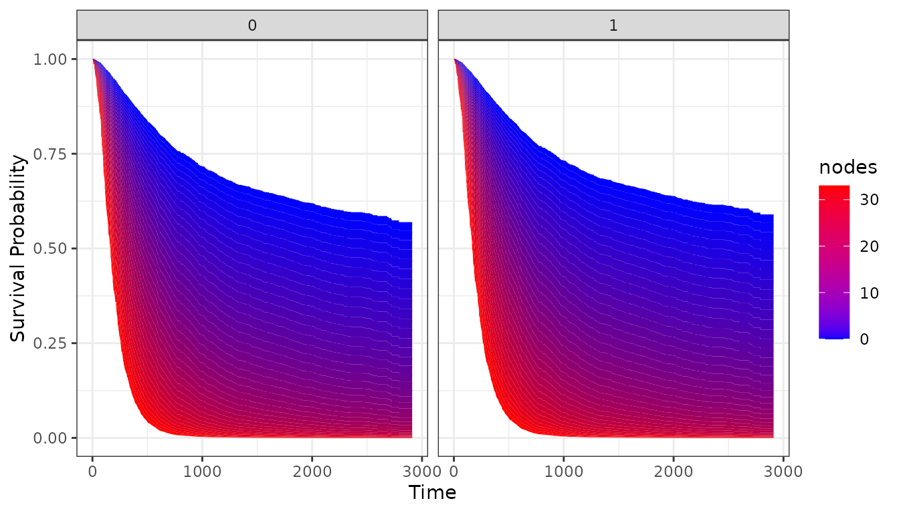

In this case, the differences are not extremely big because `sex` does
not have a big effect on the survival time.

## Literature

Robin Denz, Nina Timmesfeld (2023). “Visualizing the (Causal) Effect of
a Continuous Variable on a Time-To-Event Outcome”. In: Epidemiology 34.5

Robin Denz, Renate Klaaßen-Mielke, and Nina Timmesfeld. A Comparison of
Different Methods to Adjust Survival Curves for Confounders. Statistics
in Medicine (2023) 42:10, pages 1461-1479.

Brice Ozenne, Anne Lyngholm Sorensen, Thomas Scheike, Christian
Torp-Pedersen and Thomas Alexander Gerds. riskRegression: Predicting the
Risk of an Event using Cox Regression Models. The R Journal (2017) 9:2,
pages 440-460.

James Robins. A New Approach to Causal Inference in Mortality Studies
with a Sustained Exposure Period: Application to Control of the Healthy
Worker Survivor Effect. Mathematical Modelling (1986) 7, pages
1393-1512.
